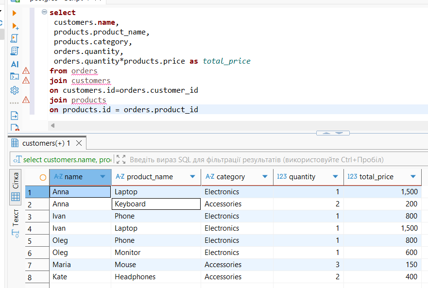

# sql-sales-analysis-project
Built a mini SQL analytics project using PostgreSQL and DBeaver.  
Created relational tables for customers, products, and orders. 
Analyzed revenue, customer spending, product performance using:  
 JOINs, GROUP BY, HAVING, Window Functions  

Tools:  
- PostgreSQL
- DBeaver

  ## Screenshots

